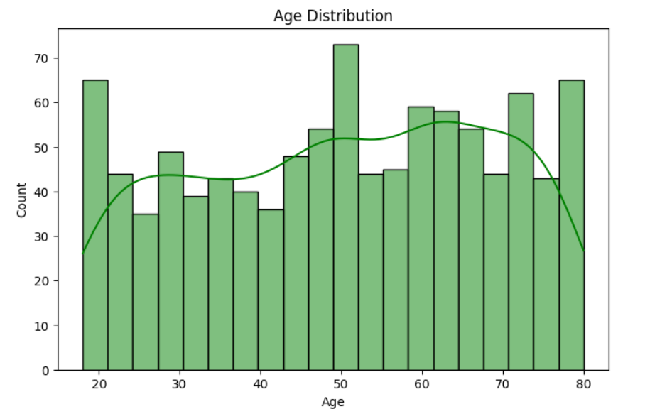
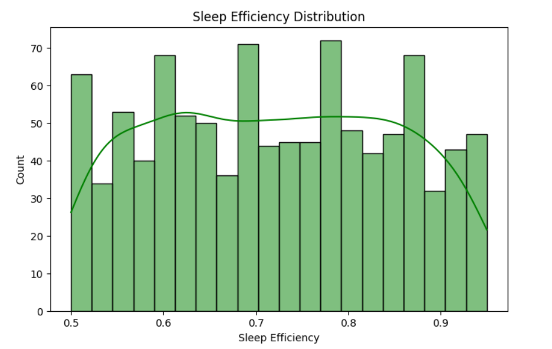
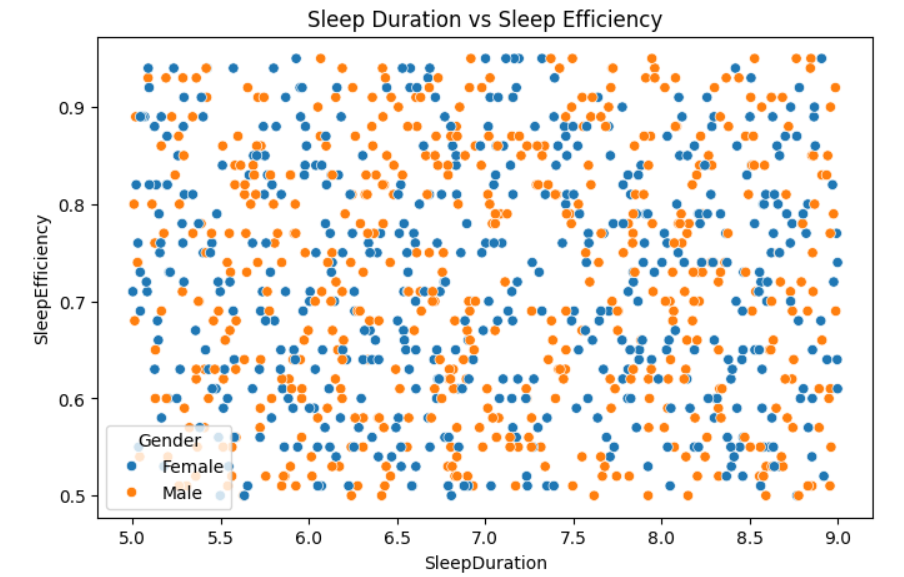
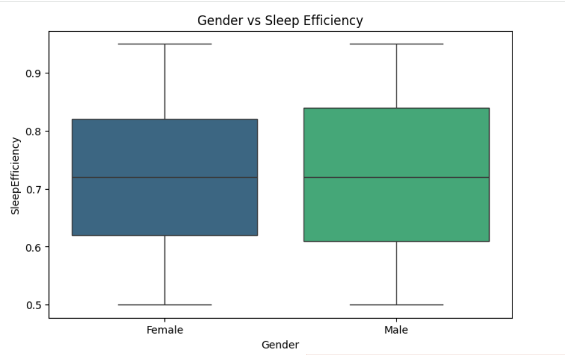
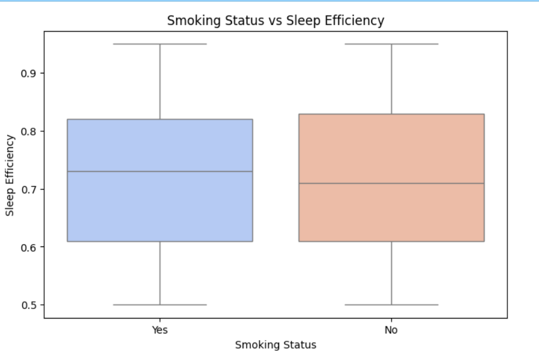
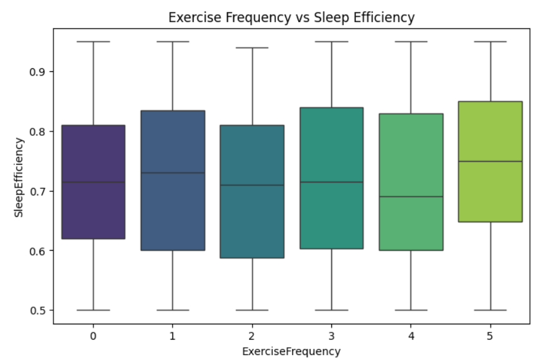
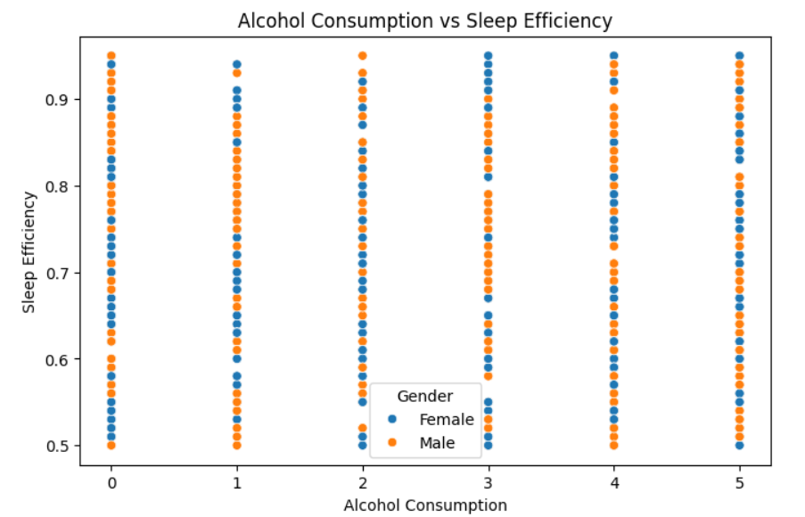
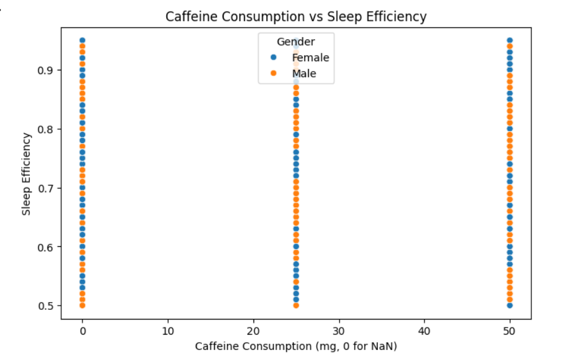
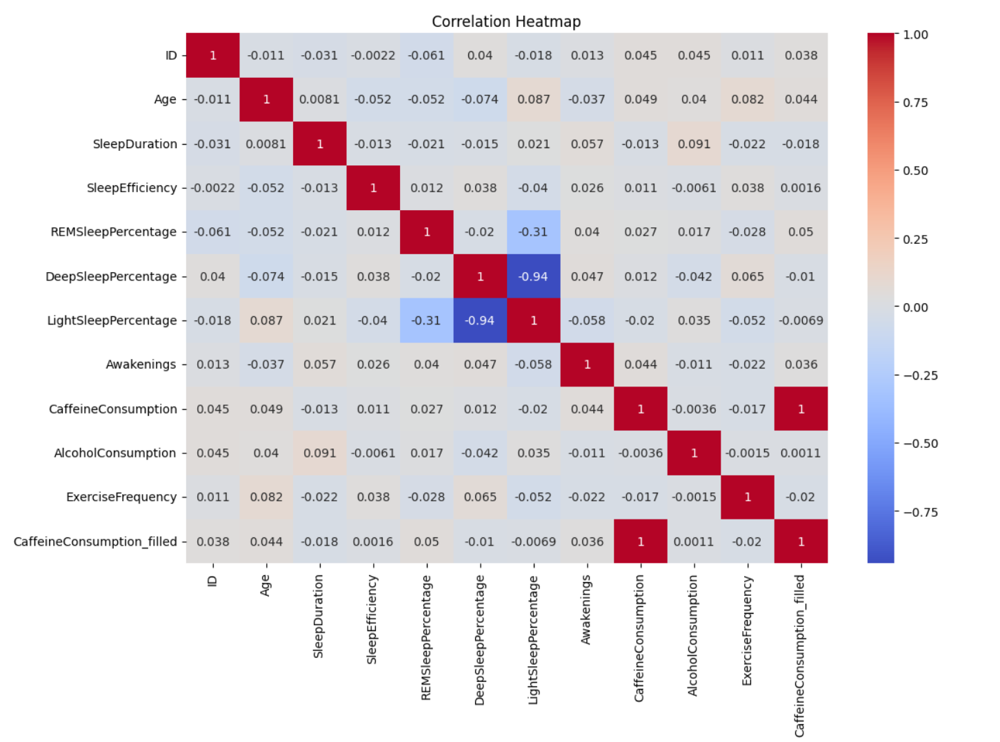

# Sleep Lifestyle Analysis using Python

## Project Overview

This project analyzes how lifestyle habits affect sleep efficiency using Python-based Exploratory Data Analysis (EDA).

The analysis focuses on identifying relationships between:

- Sleep Duration
- Sleep Efficiency
- Age
- Gender
- Exercise Frequency
- Smoking Status
- Alcohol Consumption
- Caffeine Consumption

This project demonstrates practical skills in:
- Data Cleaning
- Exploratory Data Analysis
- Data Visualization
- Correlation Analysis
- Business Insight Generation

---

# Business Problem

Poor sleep quality negatively affects:
- Health
- Productivity
- Mental Wellness
- Employee Performance

This project helps analyze how lifestyle factors influence sleep efficiency and overall well-being.

---

# Technologies Used

- Python
- Pandas
- NumPy
- Matplotlib
- Seaborn
- Google Colab

---

# Dataset Information

The dataset contains sleep and lifestyle-related information such as:

- Age
- Gender
- Sleep Duration
- Sleep Efficiency
- REM Sleep Percentage
- Deep Sleep Percentage
- Light Sleep Percentage
- Awakenings
- Caffeine Consumption
- Alcohol Consumption
- Smoking Status
- Exercise Frequency

---

# Project Workflow

## 1. Data Collection
- Imported dataset using Pandas

## 2. Data Cleaning
- Checked missing values
- Filled missing values
- Removed inconsistencies

## 3. Exploratory Data Analysis
- Distribution Analysis
- Correlation Analysis
- Pairplot Visualization
- Boxplots and Scatterplots

## 4. Business Insight Generation
- Lifestyle impact analysis
- Sleep behavior analysis
- Pattern identification

---

# Import Libraries

```python
import pandas as pd
import numpy as np
import matplotlib.pyplot as plt
import seaborn as sns
```

---

# Load Dataset

```python
df = pd.read_csv("sleep_study_1000.csv")
df.head()
```

---

# Data Cleaning

```python
df.isnull().sum()
```

```python
df['CaffeineConsumption_filled'] = df['CaffeineConsumption'].fillna(0)
```

---

# Project Visualizations

## 1. Age Distribution

<p align="center">
  
</p>

### Analysis
- Balanced age distribution across individuals
- Most participants belong to adult and middle-age groups

---

## 2. Sleep Efficiency Distribution

<p align="center">
  
</p>

### Analysis
- Most individuals show moderate to high sleep efficiency
- Few extreme low-efficiency observations

---

## 3. Sleep Duration vs Sleep Efficiency

<p align="center">
  
</p>

### Analysis
- Longer sleep duration generally improves sleep efficiency
- Sleep quality varies across individuals

---

## 4. Gender vs Sleep Efficiency

<p align="center">
  
</p>

### Analysis
- Sleep efficiency remains relatively balanced across genders
- Gender alone has limited impact on sleep efficiency

---

## 5. Smoking Status vs Sleep Efficiency

<p align="center">
  
</p>

### Analysis
- Smoking habits may affect sleep quality patterns
- Non-smokers appear slightly more stable

---

## 6. Exercise Frequency vs Sleep Efficiency

<p align="center">
  
</p>

### Analysis
- Higher exercise frequency may improve sleep quality
- Active individuals tend to show better efficiency

---

## 7. Alcohol Consumption vs Sleep Efficiency

<p align="center">
  
</p>

### Analysis
- Increased alcohol intake may negatively affect sleep
- Lifestyle habits influence sleep patterns

---

## 8. Caffeine Consumption vs Sleep Efficiency

<p align="center">
  
</p>

### Analysis
- High caffeine consumption may reduce sleep efficiency
- Sleep quality fluctuates among caffeine consumers

---

## 9. Correlation Heatmap

<p align="center">
  
</p>

### Analysis
- Strong negative correlation between Deep Sleep and Light Sleep
- Moderate relationships among lifestyle variables

---

## 10. Pairplot Analysis

<p align="center">
  
</p>

### Analysis
- Visualizes multi-variable relationships
- Useful for identifying trends and patterns

---

# Key Business Insights

1. Sleep duration positively affects sleep efficiency.

2. Lifestyle habits significantly impact sleep quality.

3. High caffeine and alcohol consumption may reduce sleep efficiency.

4. Regular exercise may improve sleep patterns.

5. Sleep behavior analysis can support wellness and productivity programs.

---

# Real-World Applications

- Healthcare Analytics
- Employee Wellness Programs
- HR Productivity Analysis
- Lifestyle Recommendation Systems
- Health Monitoring Platforms

---

# Future Improvements

- Build Machine Learning prediction model
- Create interactive Power BI dashboard
- Deploy Streamlit web application
- Add predictive healthcare analytics

---

# Conclusion

This project successfully analyzed the relationship between lifestyle habits and sleep efficiency using Python-based exploratory data analysis techniques.

The analysis demonstrated how factors such as:
- Sleep Duration
- Exercise Frequency
- Smoking Status
- Alcohol Consumption
- Caffeine Intake

influence overall sleep quality.

This project showcases practical skills in:
- Data Cleaning
- Exploratory Data Analysis
- Data Visualization
- Business Insight Generation

---

# Project Structure

```text
Sleep-Lifestyle-Analysis/
│
├── images/
│   ├── age_distribution.png
│   ├── alcohol_vs_sleep.png
│   ├── pairplot_analysis.jpg
│   ├── caffeine_vs_sleep.png
│   ├── correlation_heatmap.png
│   ├── exercise_vs_sleep.png
│   ├── gender_vs_sleep.png
│   ├── sleep_duration_vs_sleep.png
│   ├── sleep_efficiency_distribution.png
│   └── smoking_vs_sleep.png
│
├── Sleep_Lifestyle_Analysis.ipynb
├── sleep_study_1000.csv
├── analysis_report.ipynb
└── README.md
```

---

# Author

## Jyotirmaya Mishra

 Business Analytics Enthusiast | Machine Learning Learner
